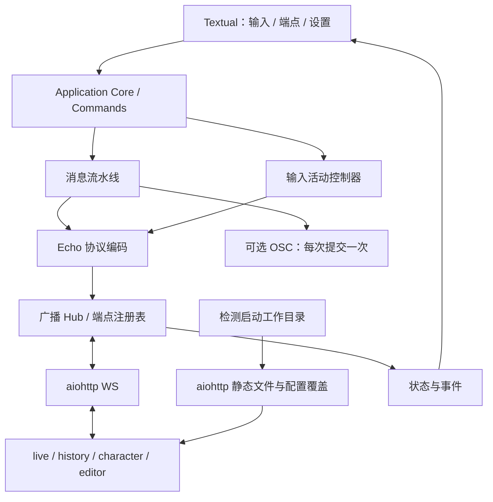

> 阶段二更新：本轮已实现 TUI 文本选区、短码补全和实时格式预览。表情、图片、Companion、版本托管均后置。默认 INFO / 输入状态开启，托管只识别当前目录及单级 EchoLive 子目录。下文第一版范围保留为历史设计，当前行为以 README 为准。

# EchoLiveTUI 第一版设计

状态：第一版已实现并持续验证。目标仓库：[xrh0905/EchoLiveTUI](https://github.com/xrh0905/EchoLiveTUI)。运行入口与实际验证见 [README](../README.md)。

2026-09-30 实施修订：默认广播到全部已连接 live；history 改为独立投递服务，取消 live 来源绑定；默认日志只报告写入失败；主屏历史区可框选复制但不可聚焦，主屏鼠标点击保持输入焦点。设置页布尔项使用带“开启/关闭”文字的选择框。

## 1. 产品目标与范围

用 Python 3.12+、Textual、asyncio 和 aiohttp 重构旧 Echo Client。第一版让主播在一个持续聚焦的输入界面中发送文字、查看广播状态、选择接收端，并在本地存在 Echo Live 文件时直接使用 HTTP 地址接入 OBS。

沿用[此前讨论](https://chatgpt.com/share/6abbee5e-81b0-83e9-96b8-5ca184af8179)的输入优先、少占快捷键、core 与界面分离，以及运行时配置覆盖。以本次明确要求收缩范围：

- **包含**：文字广播、旧短码/Markdown、拼音/注音模拟打字、自动停顿、消息修饰、VRChat OSC、输入提示、端点控制、现有目录静态托管。
- **暂不包含**：Companion、WYSIWYG、图片/表情包选择器、Echo Live 安装/下载/升级/回滚/版本管理、扩展管理、重做 Echo Live 原版配置编辑器。本程序各项功能使用内置 `/settings` TUI 设置页。
- 已确认只做本地 WS 服务端，不增加连接其他 WS 服务端的客户端模式。
- **阶段 1.5**：增加局域网发送入口，托管原版 Echo Live editor，展示识别到的局域网地址及二维码/URL，供用户直接访问，并展示发送端连接状态；独立于第一版交付。
- **阶段二**：重新设计 `/skip` 与播放/队列控制；第一版及阶段 1.5 不提供旧 `/skip`、替代别名或 `skip_mode` 设置。
- **第一版即包含客户端识别与按能力适配**：区分具体客户端、页面职责、版本、连接来源和能力；后续局域网功能复用这一模型。
- 1.8.12 为主验收版本；1.6.6 为基础广播兼容版本。中间版本使用同一协议适配，typing 能力在 1.8.7 引入，但完整输入提示验收针对 1.8.12。

交付包含源码、设置与端点界面、消息流水线、上游差异、可复现探针和自动化验证。

## 2. 使用流程和界面

```text
EchoLiveTUI                           服务运行 · 字幕端 2
发送到 主字幕 +1                     本地托管 · OSC 关闭
────────────────────────────────────────────────────────
12:40  Someone  今天继续……                已写入 2/2
       主字幕：打印中 · 副字幕：打印结束

────────────────────────────────────────────────────────
Someone → 主字幕 +1                      原文 6 字
> 今天的内容█
引号『』 · 括号关 · 后缀关 · 模拟打字 拼音 · 10ms · 停顿关
Enter 发送 · / 命令 · /settings 设置       输入提示：已发
```

- 主屏分为两行顶栏、记录区、输入上下文、输入框、增强状态栏和操作提示栏；服务消息进入 UI 事件流，不直接 `print()` 干扰输入。
- 输入保留原始短码和 Markdown，不在编辑过程中替换为富文本。仅在提交时走消息流水线。
- 普通文字 Enter 发送；`/` 命令候选由统一注册表提供；Tab 补全，候选内方向键选择，Esc 关闭。无候选时上下键回看本次会话输入。
- `//` 先于命令解析：只移除第一个 `/`，余下内容按文字发送。例如 `//settings` 发送 `/settings`，`///test` 发送 `//test`，不会再次作为命令解析。旧 `@r` 仍为重置样式；保留 `**`、`*`、旧快捷格式、拼音/注音、引号/括号/后缀。
- 第一版主输入为单行；多行粘贴打开 `/compose` 草稿框，Enter 换行，通过可 Tab 导航的“发送/取消”按钮提交；粘贴内容不自动当作一串命令执行。
- 不增加 Ctrl/Alt/F 系列应用功能绑定；移除 Textual 默认退出、命令面板等冲突绑定。文字编辑、终端复制粘贴保留必要行为；默认 Ctrl+C 不退出，退出使用 `/quit`。
- `/settings` 打开完整 TUI 设置页，使用 Tab、方向键、Enter、Esc，返回后恢复输入框焦点和消息草稿。80×24 可用，窄屏将分类栏折叠为选择器。
- 不承诺把按键转发给别的普通窗口；OBS 全局热键是否触发由终端与 OBS 的实际设置决定。

### 顶栏、输入区与底栏

顶栏回答“连通没有、发给谁”，底栏回答“这条文字会怎样处理、现在怎么操作”。详情按需展开，避免把端口、所有端点角色和全部开关堆成一行。

| 区域 | 常驻内容 | 交互与变化 |
| --- | --- | --- |
| 顶栏第一行 | 应用名、服务运行/监听失败、在线字幕端数量 | 只读，不可选，不夺焦点；详情使用底栏 endpoints |
| 顶栏第二行 | 当前发送目标摘要、本地托管/独立 WS、OSC 开关与错误状态 | 只读，不可选，不夺焦点 |
| 输入上下文行 | 当前说话人、目标摘要、原文字符数 | 就近提醒当前提交身份；字符数按 Unicode 码点计数，不冒充修饰后的输出长度 |
| 增强状态栏 | 引号实际符号/关、姓名框【】/关/仅下一条、后缀、模拟打字方案/关、速度、自动停顿开关 | 只读展示下一条设置；底栏 settings 打开设置页 |
| 最底操作提示栏 | 与当前输入上下文对应的按键提示，右侧显示输入提示状态 | 普通文字显示 Enter/命令/设置；候选打开后改为 Tab/方向键/Enter 选择/Esc；Enter 选择候选不同时提交 |

上图仅为状态示例，不改变默认引号样式。引号显示实际符号而非 `en/cn/jp`；自定义符号或后缀太长时省略，详情可查看完整内容。模拟打字关时隐藏其方案，打印速度继续可见。括号“仅下一条”消费成功后立即恢复原值，失败提交不消费。

输入提示单独显示“关闭 / 待输入 / 心跳已发 / 无支持目标 / 部分目标未知”，避免与模拟打字混淆。它不显示为观众反馈 ACK；状态文字随输入变化更新，不逐帧刷倒计时。多人打印状态保留在对应消息/端点详情，不用一个全局“播放中”概括全部终端。

无目标、监听失败、部分发送失败时，在输入区上方出现一行明确提示，不能只变颜色。临时通知使用独立提示行，不覆盖目标或增强状态。无未读错误时不常驻报警占位；详细诊断留在日志视图，记录区以消息为主。

宽度不足时按序省略版本/网络详情、缩短目标名和后缀、将次要增强项折叠为“增强 +N”；目标是否为空、引号、一次性修饰和错误不可被隐藏。80×24 保留输入与至少 8 行记录；更窄时允许状态折行。默认没有大时钟、运行时长和整排 Ctrl 快捷键。键盘访问仍通过命令/设置页，鼠标点击仅作为便利入口。

### 规范化命令

不要求兼容整套旧命令。设置页承担功能发现与修改，命令保留高频动作，并通过统一 `/set` 提供可补全的设置快捷入口。命令名和子命令用小写英文单词；帮助与补全由同一注册表生成，不维护两套命令逻辑。

| 命令 | 行为 |
| --- | --- |
| `/help [命令]` | 规范命令帮助；兼容别名单独列出 |
| `/settings [分类]` | 打开增强式 TUI 设置页，可直接定位分类 |
| `/set <设置键> <值>` | 设置注册表中的用户可修改项；提供键和值补全，使用与设置页相同的验证/保存流程 |
| `/name [名称]` | 保留为正式高频命令；有参数修改说话人，无参数显示当前名称 |
| `/quote [on\|off\|en\|cn\|jp\|custom]` | 高频引号切换；无参开/关，开启时恢复最近一次有效样式；指定样式时启用并立即显示实际符号 |
| `/paren once\|on\|off` | 下一条或持续给用户名加【】；不改变正文，无参数显示当前状态 |
| `/endpoints` | 查看端点识别与连接状态；“设置”操作跳转 `/settings endpoints` 对应端点 |
| `/target all` | 恢复向所有在线 live 发送，包含定向专用 live，并清空排除项 |
| `/target set <UUID或@名称> ...` | 替换明确的 live 选择，清空原排除项；先验证全部选择再生效 |
| `/target exclude <UUID或@名称> ...` | 替换当前排除集合；不改变包含集合 |
| `/target reset` | 与 all 相同，恢复全部在线 live 并清空排除项 |
| `/history clear` | 清空上游 history 页；遵循已配置的历史目标 |
| `/status` | 有效监听地址、托管状态、目标、连接与错误摘要 |
| `/compose` | 多行原始文本草稿 |
| `/source <文件>` | 执行包含规范命令和文字的脚本；执行前预检全部命令，不因未知命令执行半份脚本 |
| `/quit` | 关闭服务并退出 |

布尔 `/set` 值使用 `on/off`（也接受 `true/false`）；数值带明确单位提示；字符串允许带空格，沿用同一个参数解析器的引号/转义规则。`/name` 的命令后剩余文本作为名称，保留内部空格。无效或缺失参数显示用法与当前值，不改变状态。未知 `/命令` 显示建议，绝不自动当字幕发送。

设置类规范命令默认不使用无参数 toggle，明确保留 `/quote` 作为直播高频例外，并在增强栏和通知中显示切换后的结果。旧 `/typewrite`、`/scheme`、`/autopause`、`/suffix`、`/speed`、`/osc`、`/listen`、`/typing` 等入口统一迁入 `/settings` 或 `/set`。配置重载放在设置页的“从磁盘重新载入”，不沿用 hot/warm 命令分支。

`/quote off` 不丢失最近有效样式；首次开启使用默认样式 `en`。`custom` 的左右符号在设置页编辑，未配置完整时给出提示且不改变当前设置。引号开关与样式使用独立设置字段，旧 `quote_style=none` 导入为关闭并将恢复样式初始化为 `en`，其他旧样式导入为开启。`/paren once` 作用于下一次成功接受的文字提交，既不作用于命令，也不重复嵌套已有常驻括号。脚本推荐显式 `/quote on/off`，避免依赖执行前状态。

第一版收到 `/skip` 明确提示“阶段二重新设计，当前不可用”，不发包、不清队列、不作为文字广播；不接受旧 `/cancel`、`/next` 等别名来绕过这一阶段边界。

### 少量兼容入口

| 保留项 | 定位和语义 |
| --- | --- |
| `/name` | 本身已清楚、常用，直接作为正式命令，不为规范化另造更长名字 |
| `/nocc [on\|off]` | 兼容别名，映射到 `input.interrupt_guard`；on=保护开启、Ctrl+C 不退出；off=允许 Ctrl+C 退出；无参保留旧版 toggle，并立即显示结果 |
| `/clear` | 兼容 `/history clear`，不改成清本地日志，避免老用户误解 |
| `/exit` | 兼容 `/quit` |

不继续保留 `/tt`、`/ta`、`/ts`、`/ren`、`/q` 等所有旧缩写。默认补全显示正式命令；用户输入兼容前缀时仍能获得别名提示及对应正式设置。兼容入口最终进入同一 core action，不复制业务处理器。旧脚本不承诺直接兼容；预检为已移除的命令给出具体迁移入口。

`/source` 中只允许能直接完成的动作命令和上述兼容别名；`/settings`、`/compose` 等交互界面入口在预检时报告不能用于脚本，防止脚本等待界面操作。

### 增强式 TUI 设置页

```text
设置    [搜索名称、说明或设置键……]             未保存 2 项
────────────────────────────────────────────────────────
通用与输入 │ 说话人          [Someone                ]
模拟打字   │ Ctrl+C 退出保护 [开启                   ]
消息修饰   │                开启后 Ctrl+C 不退出程序
输入提示   │
端点与路由 │ 当前值 / 默认值 / 修改后值 / 生效方式
网络与托管 │
OSC        │ [恢复本分类默认值] [放弃更改] [保存并应用]
────────────────────────────────────────────────────────
Tab 切换控件 · 方向键选择 · Enter 操作 · Esc 返回输入
```

| 分类键 | 可修改内容 |
| --- | --- |
| `input` | 说话人、Ctrl+C 退出保护、输入/记录相关设置 |
| `typewriting` | 模拟打字开关、拼音/注音、打印速度、自动停顿字符与时长 |
| `formatting` | 正文引号（左右自定义符号同排）、姓名框【】、后缀；下一条临时姓名框标为仅一次 |
| `typing` | 输入提示开关与状态说明，区分“模拟打字”与“正在输入提示” |
| `endpoints` | 客户端档案、能力覆盖、字幕目标选择/排除；识别结果本身只读，人工覆盖单独标注 |
| `history` | 独立历史投递；由 TUI 暂存最新一条的可选策略，默认关闭 |
| `log` | error/info/debug，默认 error；用户消息记录独立于诊断日志 |
| `network` | 监听 host/port、展示地址、当前目录识别、托管地址、有效配置覆盖说明 |
| `osc` | VRChat OSC 开关与目标地址/端口 |

- 所有第一版用户可调功能必须在设置页可发现、可修改；运行时状态只读。暂未实现的阶段 1.5 功能不显示成可用开关，届时再扩展 `network` 分类。
- 支持跨分类搜索、开关/选择框/数字/文本专用控件、内联说明、单位、默认值、恢复本分类默认值，以及与功能依赖对应的禁用原因；不要求用户编辑 YAML。
- 每项标注“下一条消息生效”“立即生效”“重建监听”“浏览器刷新后生效”等真实效果。未知客户端能力给出原因和人工覆盖入口，不能用无说明的灰色控件。
- 修改保存在设置草稿中；“保存并应用”先整体验证再调用配置服务，成功后更新有效状态。恢复默认也只改草稿；Esc 返回消息输入时保留未保存设置草稿，再次进入继续编辑；“放弃更改”恢复有效配置。
- 保存失败保留草稿并定位错误字段。需要重建监听时沿用第 7 节的回退策略，界面区分已保存、当前生效和应用失败状态。
- `/set`、`/name`、兼容别名与设置表单共用 `SettingsService`；设置草稿未保存期间其他入口改变同字段时标注冲突，让用户在再次保存前选择保留草稿或采用当前值，不能静默覆盖。
- `SettingSpec` 统一提供设置键、分类、类型、标签、说明、默认值、范围/选项、依赖、是否可编辑及生效方式，驱动 UI、`/set` 补全和验证；端点实时状态更新不覆盖正在编辑的设置。

本程序 `/settings` 与上游网页 `settings.html` 分属两个配置边界：前者管理 TUI、消息增强、路由和网络，后者管理 Echo Live 的主题/字体等。HTTP 覆盖项在网络分类可查看；不将浏览器主题编辑扩充到本期。不加入 `/el install/update/version` 等管理命令。

## 3. 应用分层与主要接口



内部边界按职责组织为 `core`、`commands`、`message`、`echo`、`hosting`、`ui`、`config`。不在新 UI 外包一层旧 `EchoServer`；迁移旧消息纯函数，按本节规范重建命令与设置体系，重写生命周期与 I/O 边界。

| 接口/类型 | 约定 |
| --- | --- |
| `Application.submit(text)` | 区分显式命令和文字；生成一次提交，分配路由目标和可选 OSC 副作用 |
| `SettingSpec / SettingsService` | 共用设置元数据、验证、持久化和生效逻辑；提供设置草稿、冲突检查与字段错误给 UI |
| `MessagePipeline.render(text, options)` | 返回 Echo `data` 和纯文本；不持有 socket、UI 或配置写入器 |
| `BroadcastEnvelope` | `action: str`、`data: object`、`from: Origin`、`target: str \| list[str] \| None` |
| `Origin` | 进程固定 `uuid`、`name=EchoLiveTUI`、`type=server`、每帧毫秒 `timestamp`；接收时保留 `expand` |
| `Endpoint` | socket 会话 ID、上游 UUID、名称、协议角色、连接来源、`ClientProfile`、hidden、targeted、最近心跳、打印/显示状态 |
| `ClientProfile` | 客户端实现、页面职责、软件版本、运行环境、能力集合及每项识别依据；未知值显式保留 |
| `ClientClassifier` | 综合托管上下文、握手和已观察到的协议行为更新档案；不将同 IP 或同名会话合并 |
| `ClientAdapter` | 按档案给出允许的动作、消息编码、状态解释和能力降级；不直接写 socket |
| `BroadcastHub.publish/receive` | 统一编码、目标判断、每 socket 单一写入者、动作路由；不做终端输出 |
| `TypingController.changed/submitted/blurred` | 把输入活动转换为节流的标准 `editor_typing`；不发自造停止动作 |
| `HostedRoot.detect(cwd)` | 返回识别结果、静态根目录及可选版本；不下载、不搜索父目录 |
| `ConfigOverlay.render(original_js, runtime)` | 原始 JS 后附加覆盖脚本；只返回 HTTP 内容，不写 Echo Live 文件 |

Textual 和 aiohttp 共用 asyncio 循环，通过 AppRunner 管理服务，不调用另一个独占循环的 `web.run_app()`。启动失败显示在 TUI；退出时停止 typing、关闭连接、取消任务、清理 runner，再离开界面。

消息记录区区分“排队”“已写入连接”“收到打印事件”；WS 写入成功不等于观众已经看到，`echo_printing` 也不是带消息 ID 的可靠 ACK。

## 4. 当前目录识别与 HTTP 配置覆盖

### 识别和启动

只检查进程启动时的 `Path.cwd()`，不按 EXE 所在目录、不递归查找 `.reference`。以下标志文件同时存在即可识别为 Echo Live-like：`live.html`、`config.js`、`res/class/EchoLive.js`、`res/class/EchoLiveBroadcast.js`。不要求 `.git` 或固定目录名称。

存在 `app.js` 时读取其声明的版本用于提示；无法识别版本不阻止基础托管，但标记为“版本未知”。读取版本不得执行 JavaScript。

| 启动环境 | 行为 |
| --- | --- |
| 检出结构 | 同一个 aiohttp 服务提供 WS、静态资源和配置覆盖，显示可复制的 live/history URL |
| 未检出结构 | 保持旧客户端独立 WS 用法；不托管任意当前目录，不自动下载，不修改任何 Echo Live 配置 |
| 标志不完整/文件不可读 | 展示未启用托管及具体原因；WS 若能监听仍可用 |

“否则不变”按旧项目已经使用 aiohttp 理解：WS 服务仍然启动，条件控制的是静态托管与配置覆盖。

### 路由与覆盖

默认监听 `127.0.0.1:3000`。`/ws` 为规范 WS 路径；`/` 收到 WS Upgrade 时保留兼容握手，普通 HTTP 在托管模式重定向 `/live.html`，独立模式返回简明 404。`/healthz` 保留健康状态和连接数。

静态资源保持原相对路径和 MIME 类型，服务完整 `res/`、`lib/`、`lang/`、`extensions/` 以及根目录页面/资源文件；不开放目录列表、点目录、Git 文件及本程序配置。解析后的路径必须位于资源根目录，禁止借助 `..`、编码路径、符号链接或 junction 读取根外文件。

`GET /config.js` 读取原文件，追加以下属性覆盖，响应使用 JavaScript MIME 与 `Cache-Control: no-store`：

| 属性 | 运行时值 |
| --- | --- |
| `echolive.broadcast.enable` | `true`，保留广播对象作为 WS 接口 |
| `echolive.broadcast.websocket_enable` | `true` |
| `echolive.broadcast.websocket_url` | 由浏览器当前 origin 生成 `ws(s)://<location.host>/ws` |
| `echolive.broadcast.channel` | `echolivetui:<本次进程UUID>`，隔离同源的其他 BC 网络 |
| `echolive.messages_polling.enable` | `false` |
| `editor.websocket.enable` | `true` |
| `editor.websocket.url` | 同上 `/ws` 地址 |
| `editor.websocket.auto_url` | `false`，避免上游根路径/协议自动推导 |
| `editor.websocket.disable_broadcast` | `true`，所有使用基类的终端禁止 BC 发送 |
| `echolive.typing.enable` | 已有该配置结构时按 TUI typing 开关覆盖；默认开启 TUI typing |

保留用户的字体、主题、表情、重复内容展示规则和其余配置。保留 `data_version`，不把旧配置的版本号强改为 16；配置迁移继续由上游设置页负责。

不解析/重写整份 JS，不在 Python `eval` 用户配置。覆盖脚本以换行和分号隔开，以 JSON 序列化注入常量。修改 `const config` 对象属性而非重新声明变量；条件判断兼容 1.6.6 没有 typing 的情况。

原版 `settings.html` 读取配置时，附加脚本检测页面 pathname 并跳过覆盖，让设置页编辑、导出原始值，避免将临时 WS/channel 值写入用户配置。第一版仅静态提供原页面，没有配置保存 HTTP API，也不拦截浏览器文件保存器。

磁盘 `config.js` 在启动、运行、退出、异常终止后都应字节不变。直接 `file://` 打开的页面也不受影响；OBS 必须切换到 TUI 展示的 HTTP URL 才能使用覆盖。更改配置后刷新页面生效，不伪装成运行时热更新。

## 5. 广播路由、端点与历史

### 单一路径

受托管页面全部走 WS。Hub 接收一次、按目标转发一次，不回发到原 socket，不把转发帧换成新的发送者。只有 TUI 本地生成的帧使用 TUI 的 `from`。

不以文本相同或时间戳相近作为去重依据。上游没有标准消息 ID/ACK，不声称任意网络重连下的 exactly-once；第一版保证受支持拓扑内每个入站帧只转发一次、断线不自动重播。

### 客户端识别与针对性适配（第一版必须完成）

每个连接都建立独立档案，识别结果驱动路由和 UI 可用功能，而不仅用于显示一个客户端名称。将传输会话、协议身份与客户端功能档案分开：

| 维度 | 内容与识别规则 |
| --- | --- |
| 会话 | 本次 socket ID、连接代次、连接/最后活动时间；重连产生新会话 |
| 协议身份 | 上游 UUID、名称、原始 `from.type`；不把 editor 的标准角色 `server` 改写成自造协议角色 |
| 客户端实现 | Echo Live、其他已知实现、未知；不能仅因建立 WS 就认定是 Echo Live |
| 页面职责 | live、history、character、editor、其他 server、未知；同为 `server` 不一定都是网页 editor |
| 软件版本 | 与该连接关联的托管资源版本、明确元数据或用户指定值；本机资源版本不能自动赋给外部连接 |
| 运行环境 | OBS 浏览器源/停靠窗口、普通浏览器或未知；User-Agent 等仅作提示，没有可靠依据则保留未知 |
| 连接来源 | socket 观察到的 peer IP/端口、本机或局域网、是否来自本程序托管入口；IP 是网络属性，不是身份 |
| 能力 | 每项取支持/不支持/未知，并记录依据，如 `message_data`、`editor_typing`、历史事件、形象事件、显示控制 |
| 依据 | 托管上下文、协议声明、行为观察、启发式提示、用户覆盖；冲突可见，不静默把推测提升为确定事实 |

托管页面的覆盖脚本为 `/ws` 连接附带本程序命名空间内的页面上下文，服务端与当前托管资源档案关联；只用于分类，不作为权限凭据。不改 Echo Live 广播 envelope，也不向上游伪造一个不存在的版本握手动作。

直接连接的外部页面根据 hello/ping 和后续行为逐步分类；标准握手未提供的版本和能力保持未知。编辑器名称中的版本可以显示为推测值，不能独自开启只适用于特定版本的行为。用户可在端点详情覆盖识别结果，显示“手动设置”并可恢复自动识别。

| 适配档案 | 针对性行为 |
| --- | --- |
| Echo Live live | 接收文字、下一条、显示控制；解析打印状态；typing 按版本/能力启用 |
| Echo Live history | 消费 TUI 独立生成的历史事件和清空命令；不接收 message_data 或 typing |
| Echo Live character | 适配形象事件；不进入字幕目标列表 |
| Echo Live editor | 作为内容生产者和状态观察者登记；支持 ping 发现与入站发送，不误识别为 live |
| 其他 server | 保留 server 角色，按确认能力处理，不自动获得 editor 的所有行为 |
| 未知实现/角色 | 显示连接与诊断，继续识别；不默认加入字幕广播，无法确认的专属功能禁用并说明原因 |

Adapter 由客户端实现、页面职责、版本和能力共同选择；版本分支集中在适配层，UI 和广播 hub 不散落字符串判断。未知新版本可保留已经确认的基础协议能力，新增能力逐项确认。

身份来自同一连接的有效声明；遇到互相矛盾的身份/角色信息，显示识别冲突，不依据任意转发内容反复改写连接归属。关闭和重连事件只影响对应会话代次。

端点表显示“类型/版本、来源 IP、连接状态、当前目标”；详情展示能力及识别依据。一个 IP 上的 OBS、浏览器编辑器和多个标签页保持独立 UUID/会话；IP 变化不会自动生成新的持久客户端身份。

### 端点选择与重连

- `hello` 根据上游 UUID 登记，`ping` 中的 `from.type=server` 也能登记网页编辑器；重复 hello 只更新状态。
- 角色完整支持 `live/history/character/server/client/unknown`。未知会话显示为未识别，不默认当作 live。
- 经识别器确认后更新名称与角色，UUID 是身份；同 UUID 新连接替代旧连接，清理旧连接时必须检查会话代次，不能删除新会话。
- 默认文字目标是所有当前在线 live，包含 `targeted=true`。UI 在本地计算包含/排除项，再分别输出明确 UUID 目标。
- 外部帧的 UUID、`@name`、`@__role` 和反选数组按上游算法与原顺序解释，不改成无序集合。原始 `target` 保留在转发帧中。
- 名称重名时 UI 显示全部 UUID；本地 `/target set @name` 要求唯一，歧义时拒绝并保留草稿。外部 `@name` 按上游规则可匹配多个同名终端。
- UUID 选择仅在本次会话有效；持久化使用唯一名称。名称不存在或重名时显示“待绑定/歧义”，不能悄悄退回广播给所有人。

### 路由表

上游帧转发应用原 `target`；本地字幕命令使用计算后的明确目标。独立历史记录由接收的原始消息生成，使用 EchoLiveTUI 来源及各历史端 UUID，不继承字幕目标。`@__ws_server` 控制帧在服务端消费，不扩散。

| 动作 | 处理 |
| --- | --- |
| TUI `message_data`、`editor_typing` | 选定 live，各发送一次；TUI 播放控制在阶段二另行设计 |
| 网页 editor 的文字/输入/控制动作 | 保留来源，转发给符合目标的 live；其他 editor 只接收其目标本来允许的消息 |
| `ping` | 发到目标匹配的终端以发现身份；客户端 `hello` 返回给匹配的 server 并登记 |
| `hello`、`close`、`page_hidden/visible`、`echo_state_update` | 更新本地状态；按目标通知 editor/server 观察端；close 清理身份，不制造全局关闭 |
| 字幕端 `echo_printing` | 转发给匹配的 editor/server 观察端，不重复写入 history |
| `live_display_update` | 通知匹配的观察端，不改变独立历史显示策略 |
| `history_clear` | 目标匹配的 history；不向 live 注入空消息 |
| `set_avatar` | 目标匹配的 character；保留 live 派生形象事件 |
| `websocket_heartbeat` | 更新会话活跃时间；无须广播给所有页面 |
| `error/error_unknown` | 显示端点错误并按目标送给观察端，不再广播生成新错误 |
| 主题、显式断开等现有控制动作 | 按标准目标和角色转发；第一版不必为每个动作制作单独 UI |
| 未知动作 | 记录一次诊断，不自动执行或无条件泛洪 |

### 独立历史投递

history 不消费 `message_data`。`HistoryDelivery` 从 TUI 或 WS 编辑器接收的消息提取历史内容，并为每个 history 生成独立的 `echo_printing`。字幕端的 `echo_printing` 和 `live_display_update` 仅作观察事件，不再改变历史内容和可见性。

默认所有历史端立即接收，每条消息每端一次；即使没有字幕端也可工作。取消 live 来源绑定及 `/history source`。未来多轨、高级历史操作在独立服务上扩展。

HTTP 配置覆盖始终将 `history.message.latest_message_hide` 与 `live_display_hidden_latest_message_show` 设为 false；原始磁盘文件和 settings.html 不变。`history.hide_latest=false` 默认即时投递；设为 true 时由 EchoLiveTUI 每端暂存最新一条，在下一条消息到达时释放前一条。关闭该设置会释放暂存项，清空或断线会移除暂存项。非托管页面需要手工采用同样的显示配置。

保留上游 `remove_continuous_duplicate` 的用户选择；它是连续相同内容是否展示的策略，不能拿它掩盖传输重复。测试重复传输时要关闭该展示去重。

### 消息节奏与控制

文字按端点维持有界 FIFO，沿用旧流水线估算播放间隔，默认每端点最多 256 条；满时拒绝新提交并保留输入。不同端点独立推进，慢端点不阻塞其他端点。

控制、typing 和状态转发不经过文字播放延迟。每 socket 只有一个实际写入任务，由调度器安排立即控制和到期文字，避免两个协程并发写入造成乱序。已经发出的字幕不因重连重发。

第一版没有 TUI 播放中断或本地队列取消动作；`/skip` 及其替代交互留到阶段二。旧配置 `skip_mode` 不导入有效配置，也不显示为可用设置。协议层仍可按目标转发原版 editor 发来的标准 `echo_next`、`set_live_display`，但不把它们组合成 TUI 的取消操作。

无在线目标时不积攒待未来直播的消息，保留草稿并提示；开启 OSC 时可独立发送 OSC，结果分别展示，不把 OSC 成功当作字幕广播成功。每次用户提交只发送一次 OSC，不因多个 live 或 WS 回传再次发送。

## 6. 输入提示状态

- 第一处有效文字编辑立即发送 `editor_typing`，持续编辑最多每 1,500 ms 一次；不因只有光标移动或非空草稿静置而持续发送。
- 使用 trailing 节流：窗口内还有修改时最多保留一个待发更新；停键、清空、提交、进入命令或离开编辑器时按规则取消待发任务。停键超过 1,500 ms 不再续发，远端在最后一次心跳后 3,000 ms 过期。
- `/` 命令内容不作为 typing 广播；`//` 字面量文字例外。提交时取消未发心跳，随后发送具有相同 `from.uuid` 的 `message_data`。
- 已知 1.6.6 端点禁发输入提示；已确认具备该能力的新版本可启用。外部未知版本标为“能力未知”，默认不开启专属功能，用户可在端点设置中明确启用。
- capability 来自该连接的识别档案，不从标准 hello 猜版本。界面显示“输入心跳已发送”，没有 ACK 时不显示“观众已看到正在输入”。
- 本地开关默认 off；确认能力后可开启。修改托管页面配置需要刷新浏览器，设置页给出提示。

## 7. 配置与运行设置

- 本程序使用独立 `echolivetui.yaml`，默认位于启动工作目录；允许 `--config` 显式指定。它不经过静态服务公开。
- 旧 `config.yaml` 仅通过显式导入迁移到新文件；保留消息、OSC、host/port 等设置并映射到分组，原文件不改。无效配置显示具体字段错误，不自动覆盖为默认值。
- 配置分为 `input`、`listen`、`message`、`typing`、`routing`、`history`、`log`、`osc`；`input.interrupt_guard=true`、`listen.host=127.0.0.1`、`port=3000`。`/name` 对应 `message.username`。OSC 默认关闭，地址 `127.0.0.1:9000`。默认 `log.level=error`，仅写入失败报告；不从其他目录隐式读取个人配置。
- 监听地址与展示地址分开：`0.0.0.0`/`::` 只用于绑定，局域网 URL 使用明确设置的主机名/IP；本机 URL 始终可以使用 loopback。IPv6 地址正确加方括号。
- 服务端端口范围 1–65535，首版不以随机端口作为端口占用的自动回退。冲突时 TUI 仍可编辑设置、保留草稿，显示实际未监听状态。
- 改 host/port 时先验证并尝试新绑定；新绑定成功后再切换并保存，失败恢复原监听。由于同端口地址范围变更可能需要先解绑，失败时尝试重绑原地址并明确报告实际结果。
- 配置保存用临时文件 + 原子替换；不把只有内存中生效的失败设置标记为已保存。修改端口后提示刷新/修改 OBS 地址。
- HTTP 和 WS 共用端口，v1 面向本机/显式局域网使用；不添加公网部署、账户与反向代理产品流程。

## 8. 实施顺序与验收

### 实施顺序

1. 建立 Python 项目与 core/事件模型；迁入消息纯函数和 OSC 行为；用旧样例确保内容兼容。
2. 先实现 envelope、端点注册、客户端识别/适配、路由和有界发送调度；以模拟 WS 客户端验证，再用真实两版 Echo Live 交叉验证。
3. 实现 cwd 检测、静态托管与配置响应覆盖；特别验证关闭 BC 后历史和形象仍可通过 hub 工作。
4. 实现 Textual 主屏、规范命令与兼容映射、增强式 `/settings`、端点状态、typing；不引入 Qt 或 WYSIWYG 数据模型。
5. 在 Windows Terminal/conhost、真实 OBS 中验收；再做 Nuitka 单文件发行。Echo Live 资源不打包进 EXE。

### 自动化测试

| 场景 | 验收结果 |
| --- | --- |
| 两版消息样例 | 文字、Markdown、`@r`、颜色/类名、emoji ID、拼音/注音、停顿、空格/单引号编码正确 |
| 协议目标 | UUID/名称/角色/有序反选与上游方法一致；对象 target 被拒绝；同名 UI 选择不误投 |
| 多端点 | 两 live、一 history、一 character、一 editor；各动作按目标和来源正确到达；未知角色不接收文字 |
| 客户端识别 | 同 IP 多客户端不合并；editor 与其他 server 区分；托管版本不污染外部档案；未知/冲突/手动覆盖明确显示 |
| 针对性适配 | 1.6.6 live 不发送 typing、1.8.12 live 可启用；history/character 不收文字；未知能力不自动启用；重连不沿用错误适配 |
| 重复控制 | 每个 live 每帧一次，每个独立 history 每次接受消息一次；重复文本不被 hub 吞掉；字幕回报不重复写历史 |
| 会话 | 重复 hello、editor ping 注册、同 UUID 替换、旧 socket 退出、断线重连均无幽灵条目或重播 |
| 队列 | 慢连接隔离、满队列拒绝、长文本期间 typing/历史清空及时发送、断线和退出无遗留任务 |
| typing | 首键、持续编辑、停键、清空、命令、多行、提交、blur、断线及目标变化；同 UUID 清理；旧版/未知能力降级 |
| 托管检测 | 无结构、完整、残缺、无 app.js、只读目录；只检查 cwd，`.reference` 不触发自动托管 |
| 配置覆盖 | 1.6.6 与 1.8.12；原文件哈希始终不变；主题等保留；settings 页读原始值；响应无缓存 |
| HTTP | WS `/` 和 `/ws`；普通 `/`；静态 MIME/相对资源；404；根外路径/junction/点文件不可读取 |
| 监听设置 | 默认、本机/局域网、IPv6、端口占用、绑定失败回退；状态栏展示真实有效值 |
| Textual | 输入焦点/草稿恢复、补全、粘贴不执行命令、中文 IME、尺寸变化；Ctrl+C 默认不退出 |
| 命令规范 | `//settings` 发送 `/settings`、`///x` 发送 `//x`；未知命令不发字幕；正式命令与兼容别名共用处理器；`/nocc on/off` 方向正确 |
| 快速修饰 | 引号开关恢复最近样式、实际符号正确、custom 缺失不改值；括号 once 不消耗于命令/失败提交、不重复包装；命令/设置/增强栏一致 |
| 栏位与阶段边界 | 顶栏区分服务状态和接收端在线；窄屏保留目标/引号/一次性状态/错误；typing 与模拟打字区分；`/skip` 不可用且无副作用 |
| 设置页 | 全功能覆盖、搜索/依赖提示、类型验证、未保存草稿保留、恢复默认、保存失败定位、同字段冲突、监听变更回退；操作后消息草稿不丢 |
| 脚本迁移 | 含已移除命令或交互命令的脚本执行前失败并给出迁移入口，不产生部分广播 |
| OSC | 每次提交一次纯文本消息；多连接/回传不重复；OSC 错误不终止广播 |

### 必须实测的端到端场景

使用实际浏览器和 OBS 的 `live.html/history.html/character.html`，让原版网页编辑器与 TUI 同时接入。观察输入提示出现与消失、所有目标的字幕次数、历史来源绑定、历史清空、网页 editor 原生控制的转发、刷新与重连。重复测试时关闭上游内容去重，避免它隐藏传输错误。TUI `/skip` 不属于第一版验收功能。

Windows 输入法和 OBS Ctrl+C 全局热键须真人环境检查；无头 TUI 测试不能替代。1.8.x 动态扩展与资源载入、原版设置导出也需浏览器测试。验证完成前，不把源码探针结果表述为产品通过验收。

## 9. 阶段 1.5：局域网发送模式

本阶段建立在第一版识别器、适配器、静态托管和 WS hub 上。手机或另一台电脑使用浏览器里的原版 Echo Live editor 发送内容，由现有 hub 定向转发；本地 TUI 仍作为服务端。

已确定的产品流程：

1. 用户开启局域网发送模式，检查已识别的 Echo Live 目录中存在 `editor.html` 及依赖；缺失时说明原因，不自动安装或下载。
2. 枚举可用局域网接口/IP，提供选择并允许手动指定；有多个候选时展示它们，不将 VPN/虚拟网卡或默认路由地址直接宣称为接收设备可达。
3. 对实际监听的局域网地址生成 `http://<IP>:<port>/editor.html` 和内容完全相同的二维码；展示地址不能是 `0.0.0.0`、`::` 或 loopback。
4. 托管 editor 的配置响应继续指定同 origin 的 `/ws` 并禁止 BC 双路径；每个 editor 以独立生产端登记，使用自己的来源 UUID。
5. editor 建立 WS 并发出标准 ping 后，按第一版识别流程登记；展示最近活动、断线/重连状态及来源 IP、类型、版本/能力；多个发送端仍然独立。
6. 地址、端口或选中网卡发生变化时刷新 URL/二维码并标明旧入口失效；关闭局域网模式后撤销相应监听及其连接，本机模式继续可用。

用户已澄清“签到”是指通过链接访问 editor。因此本阶段没有独立签到流程或签到 API，也不扫描其他主机、主动向其他主机签到。识别的是本机可用于提供 editor 的局域网 IP，访问者通过该 URL 建立现有 WS 连接。

阶段 1.5 新增 `LanEntryService` 负责网卡/IP 候选、入口 URL 和二维码，连接识别仍使用现有 `Endpoint/ClientProfile`。入口可用状态与 WS 已连接状态分开，不能因展示二维码、访问过 HTML 或识别到 IP 就标记为发送端在线。

验收覆盖：手机扫码与手动 URL、不同网卡、同 IP 多页面、地址变化、editor 缺失、页面可访问但 WS 连接失败、WS 断线重连，以及多发送端和多 live/history 下无重复广播。二维码提供普通 URL 作为等价入口；手机实测与上游移动端 editor 兼容性验证安排在本阶段。

第一版完成独立身份/来源/能力模型及对应适配，不提前实现二维码和 LAN 自动入口。Companion、WYSIWYG 和 Echo Live 版本管理仍不在阶段 1.5 范围内。

## 10. 阶段二：重新设计播放与取消

`/skip` 整体移到本阶段，不复刻旧 `skip_mode` 的三种行为混用。开始阶段二时先明确并分别设计：跳到下一条、结束当前打印、清除本地待发队列、隐藏对话框，以及这些动作对历史记录和多个目标端点的影响。最终命令名称与交互在此阶段定案，当前不预先承诺 `/skip` 等于其中某一种动作。

协议约束已知：`echo_next` 可能推进上游消息列表，history 不处理它；空白消息和隐藏显示也不等于取消。设计与测试必须覆盖各 live 进度不同、无关联消息 ID/ACK、控制与待发文字竞态、失败/断线和历史同步，不能以发送一个近似动作就宣称取消成功。

第一版仅保留分离的消息调度器、协议适配器和端点状态，方便后续加入精确控制；没有跳过按钮、旧别名、隐藏开关或取消 API。阶段二的其他高级功能另行定范围，不因本次调整自动加入 Companion、WYSIWYG 或版本管理。

## 11. 本次决策依据

协议事实、上游版本与旧项目缺口详见 [兼容性报告](upstream-compatibility.md)。实现 API 以[Echo Live 标签源码](https://github.com/sheep-realms/Echo-Live/tree/1.8.12)和[广播文档](https://sheep-realms.github.io/Echo-Live-Doc/dev/broadcast/api/)交叉确认；用户提供的 [Echo 开发入口](https://sheep-realms.github.io/Echo-Live-Doc/dev/echo/)说明了文档滞后的可能性。

框架边界参考 [Textual 输入与绑定](https://textual.textualize.io/guide/input/)及 [aiohttp WebSocket/AppRunner 文档](https://docs.aiohttp.org/en/stable/web_quickstart.html)。实际开发时锁定并测试依赖版本，不将调查日的文档版本自动等同于产品版本。
